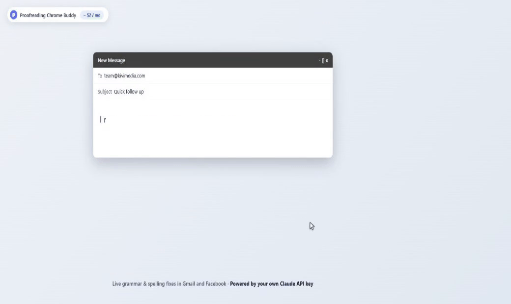

# Proofreading Chrome Buddy

**Grammarly-style writing help in Gmail and Facebook, powered by your own
Claude API key. About $2/month. Your drafts never touch a third-party
server.**

<p align="center">
  
</p>

<p align="center">
  <a href="#install-5-minutes"><strong>Install in 5 minutes &rarr;</strong></a>
  &nbsp;&middot;&nbsp;
  <a href="https://console.anthropic.com">Get an Anthropic API key</a>
  &nbsp;&middot;&nbsp;
  <a href="#what-it-costs-you-in-practice">See the costs</a>
  &nbsp;&middot;&nbsp;
  <a href="PRIVACY.md">Privacy</a>
</p>

Type an email or a Facebook post; wavy underlines appear under spelling
mistakes, awkward phrasing, and tone issues. Hover any underline for a
one-line fix. Click the fix to apply it. Select a clunky sentence and ask
Claude to rewrite it (concise, friendlier, more formal). Replying to an
email? Get three pre-drafted replies (formal / friendly / brief) ready to
drop in.

No subscription. No backend. No telemetry. Your Anthropic key lives in
`chrome.storage.local` on your device, and the only network destination
the extension talks to is `api.anthropic.com`.

> **If this saves you the Grammarly bill, [star the repo](https://github.com/kivimedia/proofreading-chrome-buddy/stargazers)** &mdash; helps it find other people who'd rather pay the AI company directly than a middleman.

---

## Why this exists

Grammarly costs ~$12/month, runs everything through their servers, and
trains models on what you write. This extension does the same job for
**roughly the cost of a coffee per month**, with these trade-offs:

| | Grammarly | Proofreading Chrome Buddy |
|---|---|---|
| Cost | $12-30 / month subscription | Pay Anthropic directly: ~$2-3 / month for heavy use, ~$0.50 light |
| Where your drafts go | Grammarly servers + ML training pipeline | Anthropic API only (no training on your data per Anthropic's API ToS) |
| Source code you can audit | No | Yes - MIT licensed, ~3500 lines |
| AI model | Grammarly's in-house | Claude Haiku 4.5 default; switch to Sonnet 4.6 / Opus 4.7 in Settings if you want stronger rewrites |
| Custom voice (rewrite in YOUR style) | No | Paste 2-3 of your past emails in Settings; Claude matches your tone for rewrites + reply drafts |
| Sites supported today | Many | Gmail + Facebook (Google Docs and Messenger on the roadmap) |

If you already pay for Anthropic for other things (Claude.ai Pro, API
projects), you're effectively paying near-zero for this feature on top.

---

## What you get

- **Live spelling, grammar, clarity, and tone suggestions** while you write
  - In Gmail compose (new emails, replies, forwards)
  - In Facebook composers (feed posts, comments, replies to comments,
    group posts, marketplace descriptions)
  - Color-coded wavy underlines: red for spelling/grammar, blue for
    clarity/conciseness, amber for tone
- **One-click fixes** - hover an underline, see the fix in a tooltip,
  click anywhere in the suggested replacement to apply it. Ctrl-Z reverts
  cleanly because we use the editor's native undo stack.
- **"Always ignore <word>"** - one click adds a word to your global ignore
  list. Useful for names, jargon, brand names that get flagged as typos.
- **Selection-triggered rewrite** - highlight a wordy sentence, hit the
  floating "Rewrite" pill, get a modal with four presets (Default /
  Concise / Friendlier / More formal). Apply replaces the selection in
  place.
- **Reply drafts (Gmail)** - opening a reply puts a "Suggest replies"
  pill at the top-right of the compose. Click for three drafts: Formal,
  Friendly, Brief. Click a draft to drop it into your reply box.
- **Your voice** - in Settings, paste 2-3 of your sent messages. Claude
  uses them to match your tone, vocabulary, sentence rhythm, and
  formality when rewriting or drafting replies.
- **Custom instructions** - free-text style rules ("Never use emdashes",
  "Always sign with Best, X") applied to every surface.
- **Cost tracking** - the extension popup shows today's token usage
  (input / output / cached) and projects a monthly cost at today's pace.

---

## Install (5 minutes)

You need a free [Anthropic API account](https://console.anthropic.com) to
get a key. Pay-as-you-go, no subscription, typical heavy personal use
runs $2-3/month.

```bash
git clone https://github.com/kivimedia/proofreading-chrome-buddy.git
cd proofreading-chrome-buddy
npm install
npm run build
```

Then in Chrome:

1. Open `chrome://extensions`
2. Toggle **Developer mode** (top right corner)
3. Click **Load unpacked** and pick the `dist/` folder inside this repo
4. Click the extension's puzzle-piece icon in the toolbar, then **Open
   settings** (or right-click the icon -> Options)
5. Paste your Anthropic API key (starts with `sk-ant-...`). Get one at
   https://console.anthropic.com -> Settings -> API Keys
6. Click **Test key**. A green "Connected" message means you're live.
7. *(Optional but recommended)* Paste a few of your past sent emails into
   the **Voice samples** box so Claude can mimic your tone for rewrites
   and reply drafts.

That's it. Open Gmail and start writing - underlines appear within ~1.5
seconds of you pausing.

---

## Try it (30-second demo)

**In Gmail**: compose a new email and type
> i recieved you're email yesterday and wanted to folow up.

Wait ~1.5 seconds. Three red wavy underlines appear under `recieved`,
`you're`, and `folow`. Hover any underline -> popover with the fix.
Click the fix -> the word swaps in. Press Ctrl-Z -> it reverts.

Select a clunky sentence, hit the blue **Rewrite** pill, pick "Concise"
in the modal. Apply replaces it in place.

**In Facebook**: open the "What's on your mind?" composer, paste a
sentence with a typo. Same wavy underlines, same one-click fixes.

**Reply drafts**: open any email in Gmail, click Reply. The blue
**Suggest replies** pill appears at the top-right. Click it -> three
drafts appear. Click one to drop it into the reply box.

---

## Privacy

- Your API key is stored only in `chrome.storage.local` on this device.
  Never synced to Google, never sent anywhere except the Anthropic API.
- The only network destination is `api.anthropic.com`. No analytics,
  no error reporting, no third party.
- The extension reads only the composer you're typing in (and, for the
  reply-drafts button, the visible thread above it when you press that
  button). It does not read incoming messages you're just viewing,
  attachments, Messenger DMs, or any other site.
- Uninstall removes everything stored locally - there's no remote copy.

Full detail: [PRIVACY.md](./PRIVACY.md).

---

## What it costs you in practice

Numbers below assume Claude Haiku 4.5 (the default) and prompt caching.

| Usage profile | Per day | Per month |
|---|---|---|
| Light (5 emails, 1-2 replies, no FB) | ~$0.02 | ~$0.50 |
| Medium (15 emails, a handful of FB posts/comments) | ~$0.05 | ~$1.50 |
| Heavy (30 emails, 10 reply-draft uses, daily FB activity) | ~$0.10 | ~$3.00 |

The popup shows your actual daily spend and projects forward. Switch
the model in Settings if you want higher quality - Sonnet 4.6 is roughly
5x the cost of Haiku, Opus 4.7 about 20x.

---

## How it works (one paragraph for the curious)

Content scripts attach to compose editors on `mail.google.com` and
`www.facebook.com`. As you type, the content script debounces 1.5s,
hashes each paragraph, and ships only the paragraphs whose hash isn't
in the cache to the service worker. The service worker forwards to
`api.anthropic.com/v1/messages` with prompt caching enabled and a
forced tool-use JSON schema for the response. Suggestions come back
with character offsets; an offset reconciler validates them against the
paragraph text and rejects any that straddle a word boundary (a safety
net for the model occasionally returning ranges that would leave word
fragments behind). Underlines render in a Shadow-DOM SVG overlay
positioned via the Range API. The popover anchors to a virtual element
whose `getBoundingClientRect` reads the live Range, so it survives any
amount of editor re-rendering. Accept uses `execCommand('insertText')`
(preserves Gmail's undo) with a synthetic `beforeinput` event fallback
for Lexical (Facebook's editor).

---

## Project layout

```
src/
  background/
    service-worker.ts        Message router, key custody, API calls
    anthropic-client.ts      fetch wrapper + cache_control + retries
  content/
    gmail-compose-detector.ts     mail.google.com - find compose editors
    facebook-composer-detector.ts facebook.com - find Lexical composers
    compose-instance.ts           Per-editor: debounce + diff + render
    paragraph-differ.ts           PlatformConfig + snapshot + hash + diff
    range-finder.ts               Char offsets -> DOM Range
    overlay-renderer.ts           Shadow-DOM SVG underlines + popover
    rewrite-controller.ts         Selection Rewrite pill + modal
    reply-assist.ts               Gmail-only Suggest-replies + modal
    text-insert.ts                execCommand -> InputEvent fallback chain
  options/                   React settings UI
  popup/                     React popup (status + cost)
  shared/
    types.ts                 Shared TypeScript types
    prompts.ts               Cached base prompts + Anthropic tool schemas
```

Stack: TypeScript strict, Vite + `@crxjs/vite-plugin` (Manifest V3
with HMR), React only for the options + popup UIs.

---

## Roadmap

Not implemented yet, in rough priority order:

- Google Docs support (Docs renders to `<canvas>` since 2021, so this
  needs a side-panel architecture rather than inline underlines).
- Chrome Web Store listing (icons, screenshots, store description).
- Streaming for the rewrite modal (chunks appear as Claude generates).
- LinkedIn, Twitter/X, Reddit.
- Messenger.com (own domain, separate composer adapter).
- Multi-language UI for the Settings page (currently English only).
- Per-paragraph cache that survives a page reload (sessionStorage).

PRs welcome.

---

## License

MIT.

---

<p align="center">
  Built by <a href="https://github.com/kivimedia">Kivi Media</a> &middot;
  <a href="https://github.com/kivimedia/proofreading-chrome-buddy/issues">Open an issue</a> &middot;
  <a href="https://github.com/kivimedia/proofreading-chrome-buddy/stargazers">Star the repo</a> if it earned its keep this month.
</p>
